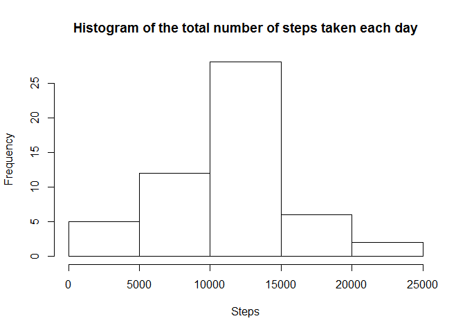
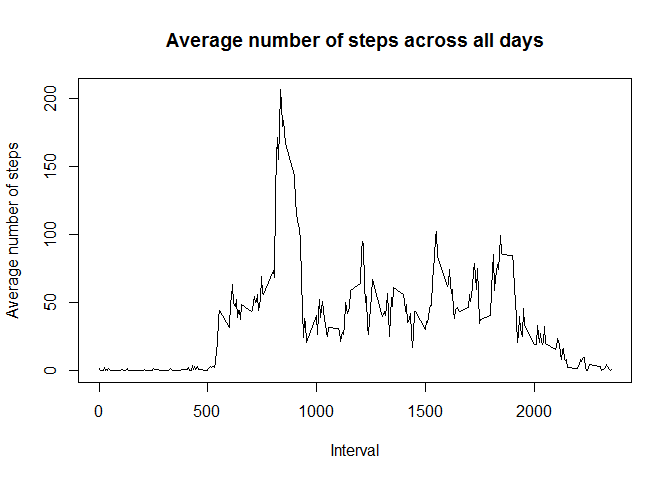
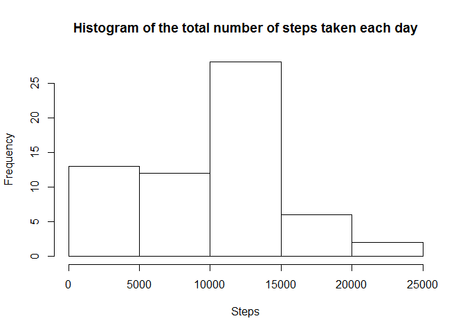
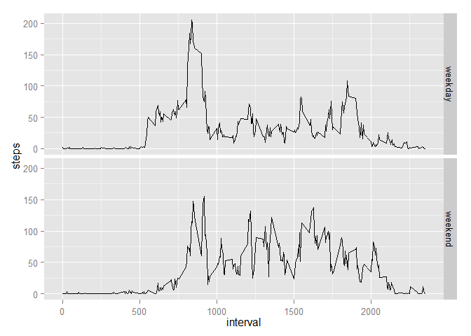

# Peer Assessment 1
Jurijs Jefimovs  
Tuesday, July 15, 2014  

```r
require(ggplot2)
```

```
## Loading required package: ggplot2
```

###Loading and preprocessing the data
1.Load the data

```r
unzip("activity.zip")
data <- read.csv("activity.csv")
str(data)
```

```
## 'data.frame':	17568 obs. of  3 variables:
##  $ steps   : int  NA NA NA NA NA NA NA NA NA NA ...
##  $ date    : Factor w/ 61 levels "2012-10-01","2012-10-02",..: 1 1 1 1 1 1 1 1 1 1 ...
##  $ interval: int  0 5 10 15 20 25 30 35 40 45 ...
```

2. Data transformation. Converting date column from factor to Date type.

```r
data$dt <- as.Date(data$date, format="%Y-%m-%d")
str(data)
```

```
## 'data.frame':	17568 obs. of  4 variables:
##  $ steps   : int  NA NA NA NA NA NA NA NA NA NA ...
##  $ date    : Factor w/ 61 levels "2012-10-01","2012-10-02",..: 1 1 1 1 1 1 1 1 1 1 ...
##  $ interval: int  0 5 10 15 20 25 30 35 40 45 ...
##  $ dt      : Date, format: "2012-10-01" "2012-10-01" ...
```

###What is mean total number of steps taken per day?
1. Histogram of the total number of steps taken each day

```r
hist_data <- aggregate(steps ~ date, data, FUN = sum)
hist(hist_data$steps, main = "Histogram of the total number of steps taken each day", xlab = "Steps")
```

 

2. The mean and median total number of steps taken per day

```r
summary(hist_data$steps)
```

```
##    Min. 1st Qu.  Median    Mean 3rd Qu.    Max. 
##      41    8840   10800   10800   13300   21200
```

```r
summary(hist_data$steps)[c("Mean","Median")]
```

```
##   Mean Median 
##  10800  10800
```

###What is the average daily activity pattern?
1. Make a time series plot (i.e. type = "l") of the 5-minute interval (x-axis) and the average number of steps taken, averaged across all days (y-axis)

```r
tseries_by_interval <- aggregate(steps ~ interval, data, FUN = mean)
plot(tseries_by_interval$interval, tseries_by_interval$steps, type = "l", main = "Average number of steps across all days", xlab = "Interval", ylab = "Average number of steps")
```

 

2. Which 5-minute interval, on average across all the days in the dataset, contains the maximum number of steps?

```r
tseries_by_interval$interval[tseries_by_interval$steps == max(tseries_by_interval$steps)]
```

```
## [1] 835
```

###Imputing missing values

1. The total number of missing values in the dataset (i.e. the total number of rows with NAs)

```r
sum(is.na(data$steps))
```

```
## [1] 2304
```

2. Devise a strategy for filling in all of the missing values in the dataset. The strategy does not need to be sophisticated. For example, you could use the mean/median for that day, or the mean for that 5-minute interval, etc.

Answer: The strategy for filling missing values is to use median for 5-minute interval across all days.

```r
median_by_interval <- aggregate(steps ~ interval, data, FUN = median)
```

3. Create a new dataset that is equal to the original dataset but with the missing data filled in.

```r
rownames(median_by_interval) <- median_by_interval$interval
na_steps <- data$interval[is.na(data$steps)]
data$steps[is.na(data$steps)] <- median_by_interval[as.character(na_steps),"steps"]
```

4. Make a histogram of the total number of steps taken each day and Calculate and report the mean and median total number of steps taken per day.

```r
hist_data <- aggregate(steps ~ date, data, FUN = sum)
hist(hist_data$steps, main = "Histogram of the total number of steps taken each day", xlab = "Steps")
```

 

```r
summary(hist_data$steps)
```

```
##    Min. 1st Qu.  Median    Mean 3rd Qu.    Max. 
##      41    6780   10400    9500   12800   21200
```

```r
summary(hist_data$steps)[c("Mean","Median")]
```

```
##   Mean Median 
##   9500  10400
```

Question 1:     Do these values differ from the estimates from the first part of the assignment?
Answer 1:       Yes, they do. After filling missing values, Mean and Median is shifted to the left.

Question 2:     What is the impact of imputing missing data on the estimates of the total daily number of steps?
Answer 2:       It is obvios that after imputing data, totals has increased where data was imputed.

###Are there differences in activity patterns between weekdays and weekends?
1. Create a new factor variable in the dataset with two levels – “weekday” and “weekend” indicating whether a given date is a weekday or weekend day.

* NOTE: weekday() function prints weekdays using local regional settings. (for instance if you have russian locale, you will get russians weekday names).Instead i use format() with "format" = %u (Weekday as a decimal number 1–7, Monday is 1)


```r
data$weekday <- format(data$dt, format = "%u") #see *NOTE above
data$weekday_name[data$weekday < 6] <- "weekday"
data$weekday_name[data$weekday >= 6] <- "weekend"
```

2. Make a panel plot containing a time series plot (i.e. type = "l") of the 5-minute interval (x-axis) and the average number of steps taken, averaged across all weekday days or weekend days (y-axis).


```r
tseries_by_weekday_interval <- aggregate(steps ~ interval + weekday_name, data, FUN = mean)
qplot(interval, steps, data=tseries_by_weekday_interval, geom="line",facets = weekday_name~. )
```

 
